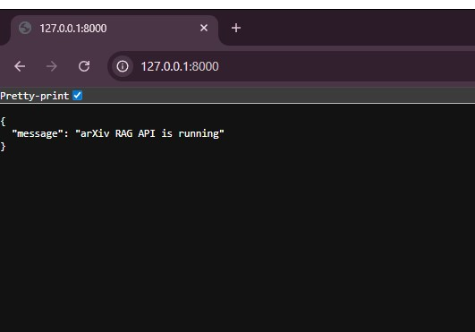
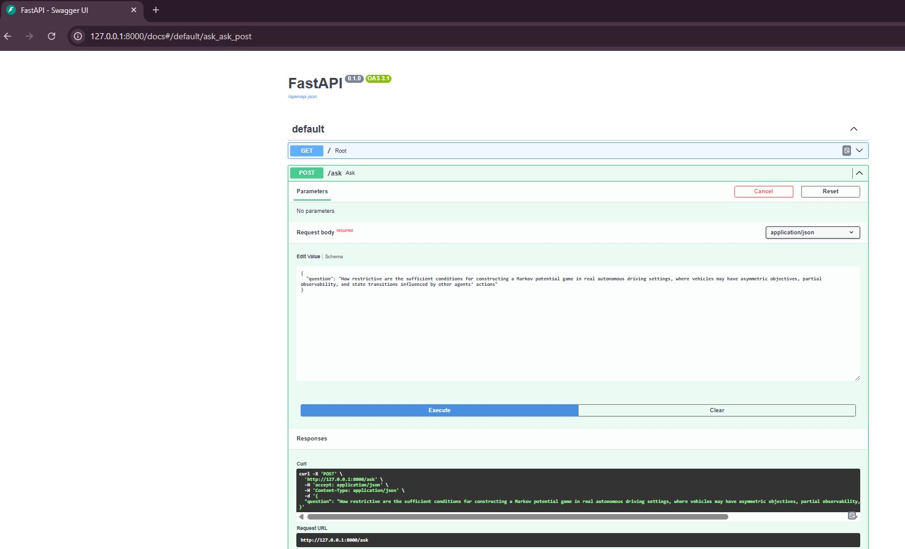
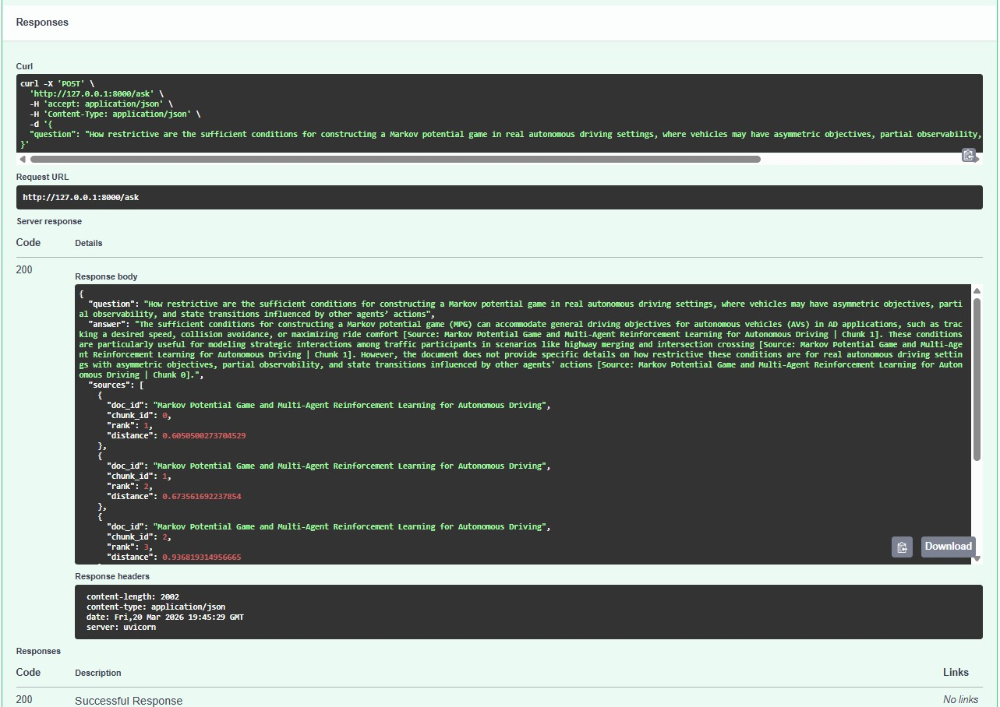
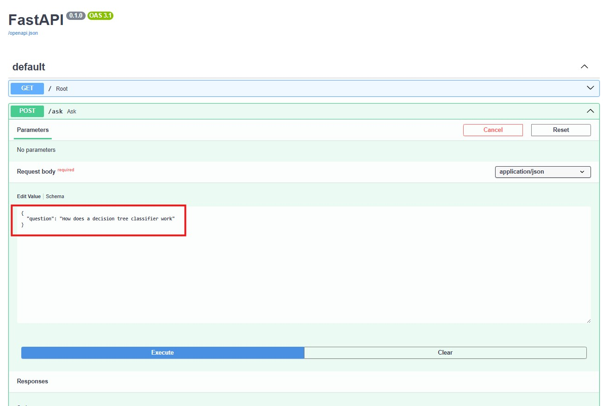
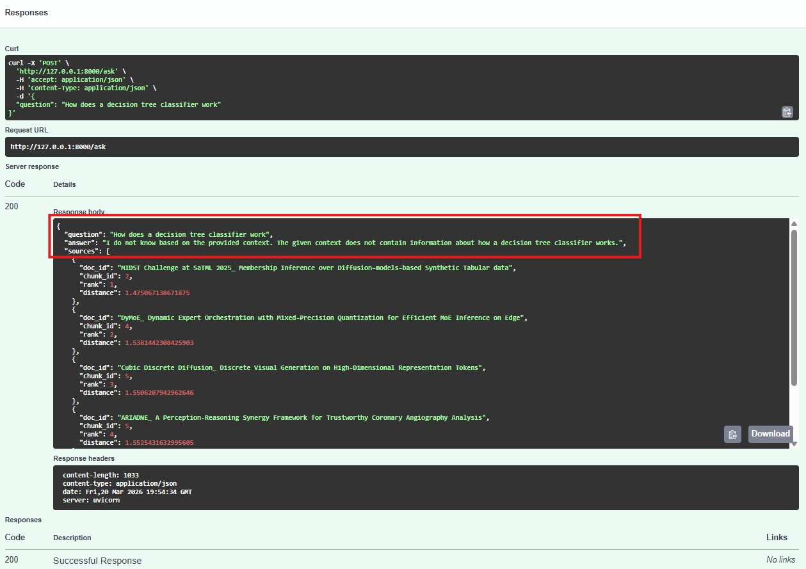

# AI Research Assistant (RAG over arXiv Papers)

A GPU-accelerated Retrieval-Augmented Generation (RAG) system that ingests arXiv papers and answers questions with grounded source citations using a local LLM.

---

## Features

- End-to-end RAG pipeline (PDF → embeddings → FAISS → LLM)
- Local inference using GPU
- Grounded answers with source citations
- FastAPI backend with interactive Swagger UI
- Handles unsupported queries without hallucination

---

## Architecture

arXiv PDFs → Text Extraction → Chunking → Embeddings → FAISS → Retriever → LLM → Answer + Sources

---

## Dataset

This system was built on a diverse collection of **50+ arXiv papers** across:

- Machine Learning & LLMs
- Robotics & Autonomous Systems
- Computer Vision & 3D Generation
- Physics & Mathematics
- Optimization & Systems

Full list: [`assets/papers.txt`](./assets/papers.txt)

---

## Screenshots

### API Running


---

### Valid Query (Input)


---

### Valid Query (Answer with Sources)


---

### Unsupported Query (Input)


---

### Unsupported Query (Handled Correctly)


---

## Handling Unsupported Queries

The system avoids hallucinations by detecting when no relevant context exists.

### Example

**Question:**
How does a decision tree classifier work?

**Answer:**
I do not know based on the provided context. The given context does not contain information about this topic.

---

## Example Request

```json
POST /ask

{
  "question": "What conditions does Theorem 4 require for an MPG?"
}
